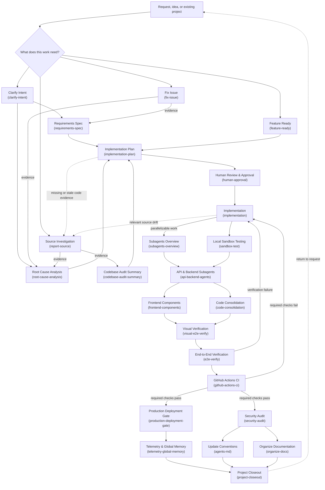

# Agentic Software Engineering Workflow

A 26-node workflow for agent-driven software delivery: intake and routing, evidence
gathering, human authorization, parallel implementation, verification, CI gating,
security audit, and closeout.

Twenty-four of the nodes are backed by a skill in [`../skills/`](../skills/). The two
remaining nodes (`START`, `DECISION`) are control-flow only and carry no skill.

Every skill-bearing node label ends with its skill slug in parentheses. This is a
machine contract, not a convention: [`../scripts/validate-pack.py`](../scripts/validate-pack.py)
parses these slugs and asserts they match `skill-pack.json` and the `skills/` directory
exactly. Renaming a node without renaming its skill fails CI.

Provenance of each node — replicated from the source workflow, inferred, or original —
is recorded in [`workflow-fidelity.md`](workflow-fidelity.md). Chinese mirror:
[`workflow.zh-CN.md`](workflow.zh-CN.md).

## Layers

| Layer | Purpose | Nodes |
|---|---|---|
| 1. Intake and routing | Classify the request before spending any effort on it | `START`, `DECISION`, `clarify-intent`, `fix-issue`, `report-source`, `feature-ready` |
| 2. Evidence and planning | Produce evidence artifacts, then a plan, then obtain human authorization | `requirements-spec`, `root-cause-analysis`, `codebase-audit-summary`, `implementation-plan`, `human-approval` |
| 3. Implementation and verification | Braided parallel execution with two sync points, then acceptance | `implementation`, `subagents-overview`, `sandbox-test`, `api-backend-agents`, `frontend-components`, `code-consolidation`, `visual-e2e-verify`, `e2e-verify` |
| 4. Gating and closeout | CI gate, then parallel release and governance tracks converging on closeout | `github-actions-ci`, `production-deployment-gate`, `telemetry-global-memory`, `security-audit`, `agents-md`, `organize-docs`, `project-closeout` |

## Design notes

**Human authorization is a hard gate, not a suggestion.** `implementation-plan` cannot
reach `implementation` without passing through `human-approval`. The operator sets goals,
approves architecture, and accepts risk; the agent matrix executes and self-corrects.

**Clear requirements do not establish current code evidence.** `feature-ready` may enter
planning when the requested outcome is specified, but changes to existing code need a
relevant codebase audit with a comparable source baseline. Missing or stale evidence returns
to source investigation and a scoped audit before review. Implementation compares the
approved baseline with current code and routes relevant unplanned changes through the same
evidence and approval path; unaffected authorized tasks may continue when proven independent.

**The parallel section is braided, not two straight rails.** Fan out to
`subagents-overview` and `sandbox-test`, sync at `api-backend-agents`, fan out again to
`frontend-components` and `code-consolidation`, sync at `visual-e2e-verify`. The mid-point
sync exists because both tracks depend on a stable API surface; letting them run to
completion independently produces two implementations that do not compose.

**Verification failure and CI failure are different failures.** `e2e-verify` failing means
the behaviour is wrong. `github-actions-ci` failing means the repository is wrong — lint,
types, tests, build. They return to `implementation` on separate edges because the
diagnosis differs.

**CI success forks, it does not chain.** `production-deployment-gate` and `security-audit`
are siblings. Chaining them so the audit runs after the deployment gate would mean auditing
what has already shipped.

**The loop closes.** `project-closeout` returns to `START`, because the output of one cycle
is the input to the next.
