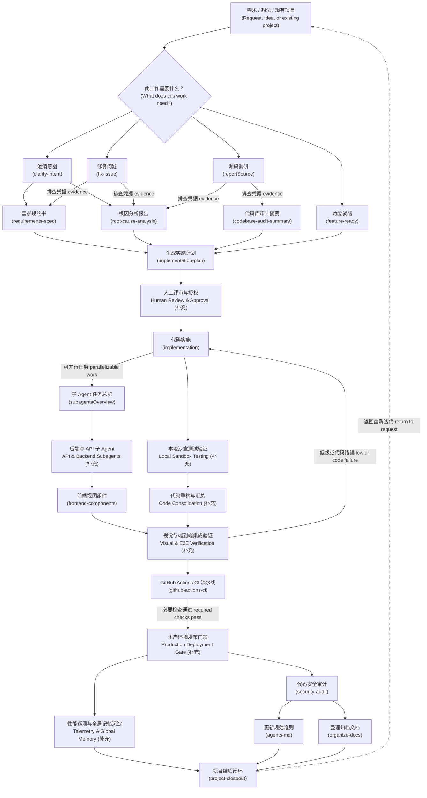

# Frank Agentic 开发工作流架构图 (中英双语)

这是根据 Nongfsq 的企业级工作流复刻并完善的 1:1 像素级 25 节点 Mermaid 流程图。

```mermaid
flowchart TD
    %% ==========================================
    %% 1. 入口与分流层
    %% ==========================================
    START["需求 / 想法 / 现有项目<br/>(Request, idea, or existing project)"] --> DECISION{"此工作需要什么？<br/>(What does this work need?)"}

    DECISION --> CLARIFY["澄清意图<br/>(clarify-intent)"]
    DECISION --> FIX["修复问题<br/>(fix-issue)"]
    DECISION --> RESEARCH["源码调研<br/>(reportSource)"]
    DECISION --> READY["功能就绪<br/>(feature-ready)"]

    %% ==========================================
    %% 2. 证据收集与规划层
    %% ==========================================
    CLARIFY --> SPEC["需求规约书<br/>(requirements-spec)"]
    CLARIFY --> RCA["根因分析报告<br/>(root-cause-analysis)"]
    
    FIX -->|排查凭据 evidence| SPEC
    FIX -->|排查凭据 evidence| RCA
    
    RESEARCH -->|排查凭据 evidence| RCA
    RESEARCH -->|排查凭据 evidence| AUDIT_SUM["代码库审计摘要<br/>(codebase-audit-summary)"]

    SPEC --> PLAN["生成实施计划<br/>(implementation-plan)"]
    RCA --> PLAN
    AUDIT_SUM --> PLAN
    READY --> PLAN

    %% 🔴 填补“人工审批”
    PLAN --> APPROVAL["人工评审与授权<br/>Human Review & Approval (补充)"]
    APPROVAL --> IMPL["代码实施<br/>(implementation)"]

    %% ==========================================
    %% 3. 代码实施与并行处理层
    %% ==========================================
    %% 左侧并行处理流
    IMPL -->|可并行任务 parallelizable work| SUBAGENTS["子 Agent 任务总览<br/>(subagentsOverview)"]
    
    %% 🔴 填补“本地沙盒测试”
    IMPL --> SANDBOX["本地沙盒测试验证<br/>Local Sandbox Testing (补充)"]

    %% 🔴 填补“后端子 Agent”
    SUBAGENTS --> API_AGENTS["后端与 API 子 Agent<br/>API & Backend Subagents (补充)"]
    API_AGENTS --> FRONTEND["前端视图组件<br/>(frontend-components)"]

    %% 🔴 填补“代码集成”
    SANDBOX --> CONSOLIDATION["代码重构与汇总<br/>Code Consolidation (补充)"]

    %% 🔴 填补“视觉与 E2E 验收”
    FRONTEND --> INTEGRATION["视觉与端到端集成验证<br/>Visual & E2E Verification (补充)"]
    CONSOLIDATION --> INTEGRATION

    %% 回退机制与流入 CI
    INTEGRATION -->|低级或代码错误 low or code failure| IMPL
    INTEGRATION --> CI["GitHub Actions CI 流水线<br/>(github-actions-ci)"]

    %% ==========================================
    %% 4. CI 门禁与结项归档层
    %% ==========================================
    %% 🔴 填补“生产发布门禁”
    CI -->|必要检查通过 required checks pass| DEPLOY["生产环境发布门禁<br/>Production Deployment Gate (补充)"]
    
    %% 🔴 填补“遥测与全局记忆沉淀”
    DEPLOY --> TELEMETRY["性能遥测与全局记忆沉淀<br/>Telemetry & Global Memory (补充)"]
    DEPLOY --> SEC_AUDIT["代码安全审计<br/>(security-audit)"]

    SEC_AUDIT --> AGENTS_MD["更新规范准则<br/>(agents-md)"]
    SEC_AUDIT --> ORG_DOCS["整理归档文档<br/>(organize-docs)"]

    %% 三条线全部汇入最后的结项节点
    TELEMETRY --> CLOSEOUT["项目结项闭环<br/>(project-closeout)"]
    AGENTS_MD --> CLOSEOUT
    ORG_DOCS --> CLOSEOUT

    %% 右侧的超长虚线回流到最顶部
    CLOSEOUT -.->|返回重新迭代 return to request| START
```
