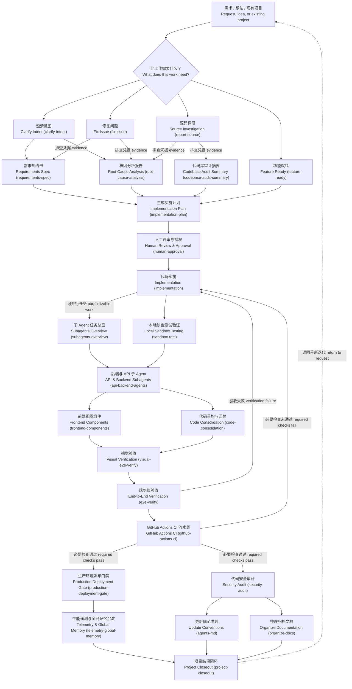

# Agentic 软件工程工作流

面向 Agent 驱动的软件交付的 26 节点工作流：需求分流、证据收集、人工授权、并行实施、
验收、CI 门禁、安全审计、结项闭环。

其中 24 个节点由 [`../skills/`](../skills/) 下的 skill 承载，另外两个节点
（`START`、`DECISION`）仅承担控制流，不绑定 skill。

每个承载 skill 的节点标签都以括号内的 skill slug 结尾。这是**机器契约**而非书写习惯：
[`../scripts/validate-pack.py`](../scripts/validate-pack.py) 会解析这些 slug，并断言其与
`skill-pack.json`、`skills/` 目录三方严格相等。改了节点却没改 skill，CI 直接红。

每个节点的溯源标注（复刻 / 推断 / 原创）记录在
[`workflow-fidelity.md`](workflow-fidelity.md)。英文版本：[`workflow.md`](workflow.md)。

## 分层

| 层 | 职责 | 节点 |
|---|---|---|
| 1. 入口与分流 | 在投入任何成本之前先把需求归类 | `START`、`DECISION`、`clarify-intent`、`fix-issue`、`report-source`、`feature-ready` |
| 2. 证据与规划 | 先产出证据凭据，再产出计划，最后取得人工授权 | `requirements-spec`、`root-cause-analysis`、`codebase-audit-summary`、`implementation-plan`、`human-approval` |
| 3. 实施与验收 | 带两个汇聚点的编织式并行执行，随后进入验收 | `implementation`、`subagents-overview`、`sandbox-test`、`api-backend-agents`、`frontend-components`、`code-consolidation`、`visual-e2e-verify`、`e2e-verify` |
| 4. 门禁与结项 | CI 门禁，之后发布轨与治理轨并行推进并汇入结项 | `github-actions-ci`、`production-deployment-gate`、`telemetry-global-memory`、`security-audit`、`agents-md`、`organize-docs`、`project-closeout` |

## 设计说明

**人工授权是硬门禁，不是建议。** `implementation-plan` 无法绕过 `human-approval` 直达
`implementation`。人负责设定目标、把关架构、承担风险；Agent 矩阵负责执行与自我纠错。

**并行段是编织结构，不是两条平行直轨。** 先散开到 `subagents-overview` 与 `sandbox-test`，
在 `api-backend-agents` 汇聚，再散开到 `frontend-components` 与 `code-consolidation`，
最后在 `visual-e2e-verify` 汇聚。中途这次汇聚是必要的：两条轨道都依赖一个稳定的 API
接口面，放任它们各自跑到底，产出的会是两套无法拼合的实现。

**验收失败与 CI 失败是两类失败。** `e2e-verify` 失败意味着**行为**错了；
`github-actions-ci` 失败意味着**仓库**错了 —— lint、类型、测试、构建。二者诊断路径不同，
因此走两条独立的回退边。

**CI 通过是分叉，不是串联。** `production-deployment-gate` 与 `security-audit` 是兄弟节点。
把安全审计串在发布门禁之后，等于在审计一个已经上线的东西。

**闭环是闭合的。** `project-closeout` 回流至 `START` —— 一轮的产出就是下一轮的输入。
